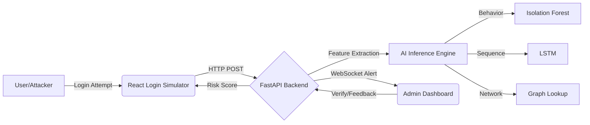

# 🛡️ SecureWatch AI: Financial Fraud Early Warning System

SecureWatch AI is a real-time, adaptive security monitoring system designed to detect and prevent **Account Takeover (ATO)** in financial platforms. Unlike static rule-based systems, it uses a **Multi-Model AI Architecture** to identify behavioral anomalies, automated bot attacks, and fraud rings within milliseconds.

---


## 🎯 Project Objectives & Features

This system addresses four major security challenges:

### 1. 🚦 Real-Time Anomaly Detection

* **Engine:** Hybrid AI (Isolation Forest + Autoencoder)
* **Function:** Flags unusual logins (new devices, suspicious geo-locations, impossible travel)
* **Latency:** Under 200ms

### 2. 🧠 Contextual Risk Differentiation

* **Engine:** Custom Logic Layer & LSTM
* **Explains WHY an alert was triggered:**

  * 🌍 Location mismatch (Impossible Travel)
  * 🤖 Bot-like patterns
  * 🕸️ Fraud ring association

### 3. 🔔 Instant Alerting System

* **Tech:** WebSockets
* **Function:** Real-time push notifications to admin dashboard

### 4. 🔄 Adaptive Feedback Loop

* **Tech:** Human-in-the-loop API
* **Function:** Admin verification improves model performance over time

---

## 🏗️ System Architecture



---

## 📂 Project Structure

```
secure-watch-ai/
├── backend/                 # FastAPI + AI
│   ├── app/
│   │   ├── api/             # REST Endpoints
│   │   ├── services/        # AI Logic
│   │   └── main.py          # Entry Point
│   ├── ml_artifacts/        # Trained Models
│   └── requirements.txt
│
├── frontend/                # React
│   ├── src/
│   │   ├── pages/           # Dashboard + Simulator
│   │   ├── api/             # Axios client
│   │   └── App.jsx
│   └── vercel.json
│
├── research/                # AI Training
│   ├── phase1_train_GNN.ipynb
│   ├── phase1_train_lstm.ipynb
│   └── data/
│
└── Dockerfile               # Deployment Config
```

---

## 🛠️ Setup & Installation

### **Prerequisites**

* Python 3.10+
* Node.js
* Git

### **1. Backend Setup**

```bash
cd backend
python -m venv .venv
# Activate
# Windows: .venv\Scripts\activate
# Mac/Linux: source .venv/bin/activate
pip install -r requirements.txt
uvicorn app.main:app --reload
```

Backend runs at: **[http://127.0.0.1:8000](http://127.0.0.1:8000)**

### **2. Frontend Setup**

```bash
cd frontend
npm install
npm run dev
```

Frontend runs at: **[http://localhost:5173](http://localhost:5173)**

---

## 🚀 Deployment Guide

### **Backend (Render / Docker)**

* Uses Dockerfile in root
* Runs Uvicorn on port 80
* Set env variable: `TF_USE_LEGACY_KERAS=1`

### **Frontend (Vercel)**

* SPA deployment
* Requires environment variable: `VITE_API_URL`
* Supports ngrok for live demos

---

## 👨‍💻 Tech Stack

| Component       | Technology               | Purpose                      |
| --------------- | ------------------------ | ---------------------------- |
| Backend         | FastAPI                  | High-performance async API   |
| ML Models       | TensorFlow, Scikit-learn | Anomaly + sequence detection |
| Data Processing | Pandas, NumPy            | Feature engineering          |
| Frontend        | React (Vite)             | Interactive dashboard        |
| Visualization   | Recharts                 | Real-time graphs             |
| Real-Time       | WebSockets               | Live alerting                |

---

## 🧪 Demo Instructions (Attack Simulator)

1. Open Dashboard
2. Click **Launch App**
3. Test scenarios:

   * 🟢 **Normal User** → Clean login
   * 🔴 **Bot Script** → "Automated Bot Behavior Detected"
   * 🕸️ **Fraud Ring** → "Linked to Fraud Ring"

---


Built for **VITALITY'25 GFG HACKATHON**.
